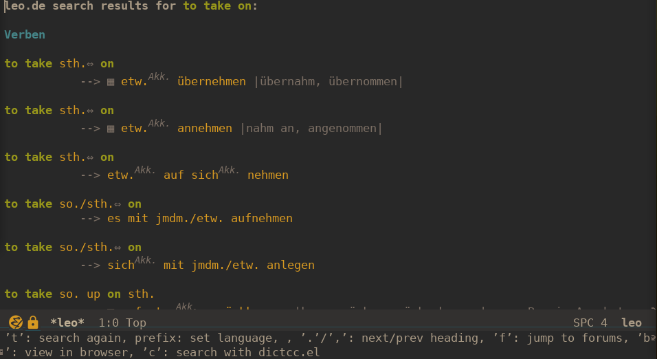

# leo.el

This package allows you to interact with [Leo.de](https://leo.de) dictionaries from within emacs.

NB: this repo has now been merged into [emacs-leo](https://github.com/mtenders/emacs-leo), so you can install it from MELPA.

It provides the commands `leo-translate-word` and `leo-translate-at-point`. They translate between German and the language set by the custom variable `leo-language`. The second language can also be specified interactively by invoking the commands with a prefix argument.

Results are sorted by part of speech, and display all additional information about the term such as usage, case markers, linguistic variant, etc. They also include a direct link to conjugation or inflection tables, shown as the icon `▦` (or `#`).

In the results buffer:

- click on a word to search for it
- `<tab>` to a word or phrase then hit `<return>` to search for it
- `t` to search again
- `C-u t` to search again and choose your language
- `,` and `.` to go to the previous/next part of speech heading.
- `f` to jump to forum results
- click on a part of speech heading to view more results of only that type.
- `b` to view results in external browser
- and `c` to search the same term with [dictcc.el](https://github.com/martenlienen/dictcc.el) if it's installed.

Links to forum results are also displayed. It is better to view these externally, which you can do by `C-u RET` with point on an entry. 

If no results are returned, a list of suggestions is displayed which are also click (or tab/return) to search.

For the moment there is no functionality to return to previous result. The easiest way to do this is `t` for a new search, then `M-p` to scroll back through search history.

Available languages: `en`, `es`, `fr`, `it`, `ch`, `pt`, `ru`, `pl`.

The pairs tested while hacking on this are `en` < > `de`, plus a little `fr` < > `de`. Other languages may not work as well. The propertizing of entries isn't perfect, but it's good enough to rely on and is still being improved.

It looks like this:

